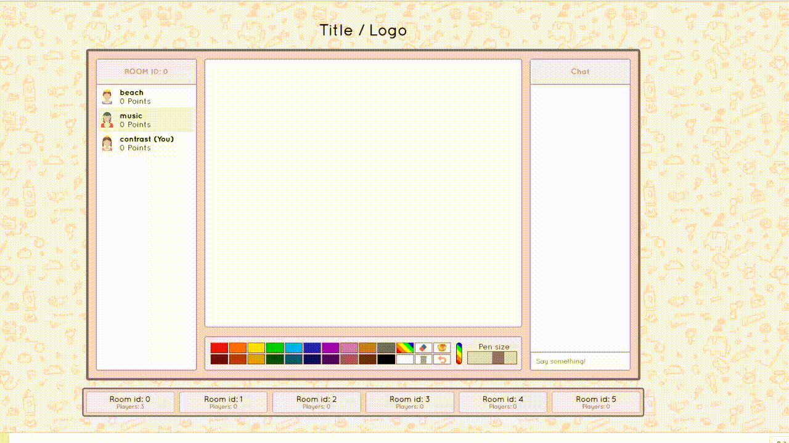

## Draw git repository
A multi-user drawing game made with Node.js server-wise utilising HTML5's canvas and web sockets.

### Usage
Run server via CMD with ```node server.js``` in root directory. Server should open on ```http://localhost:8080``` by default.

### Demo

